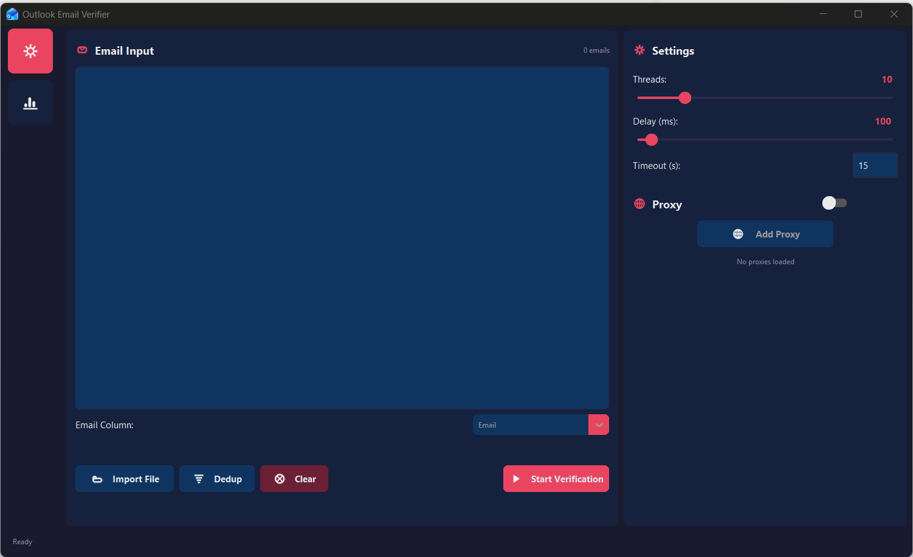
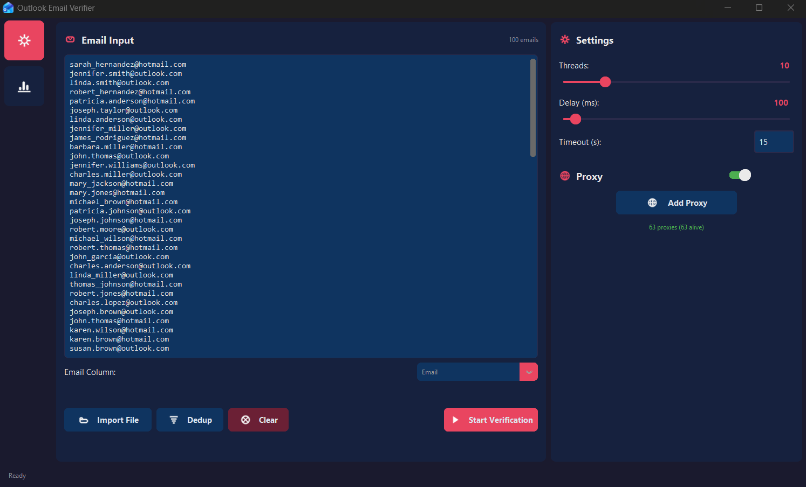
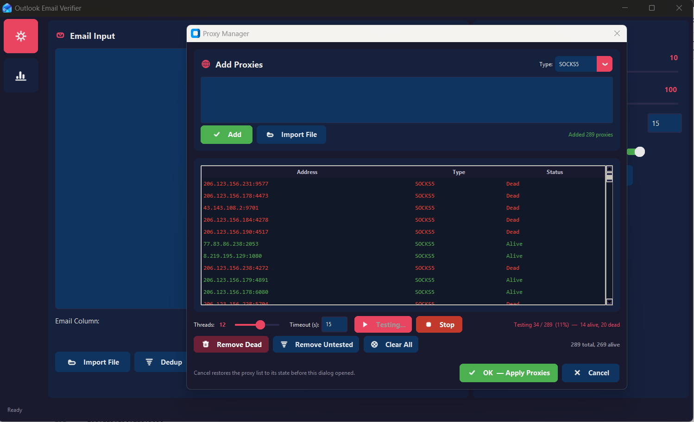
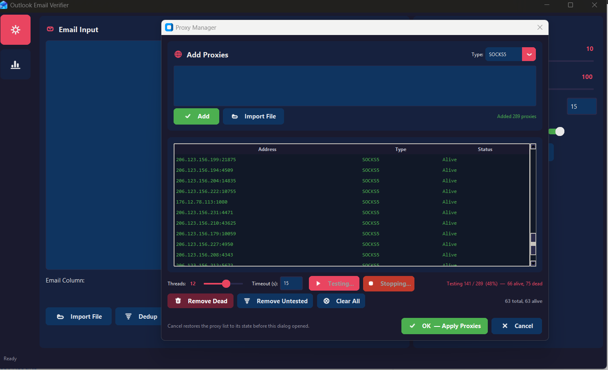
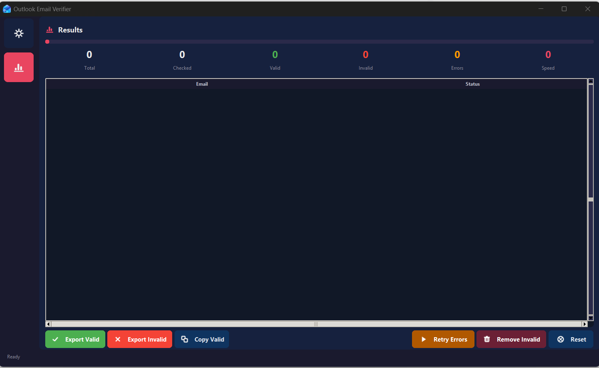
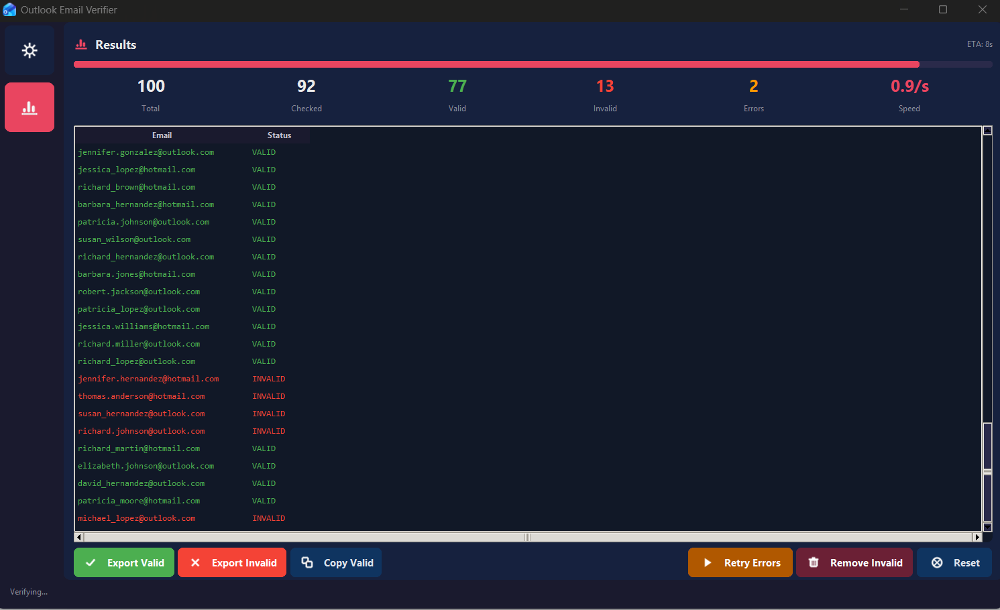

# Outlook Email Verifier — User Guide

**Version 3.0** · Windows Desktop Application

---

## Table of Contents

1. [Overview](#1-overview)
2. [System Requirements](#2-system-requirements)
3. [Launching the Application](#3-launching-the-application)
4. [Step 1 — Preparing Your Email List](#4-step-1--preparing-your-email-list)
5. [Step 2 — Configuring Verification Settings](#5-step-2--configuring-verification-settings)
6. [Step 3 — Setting Up Proxies (Optional)](#6-step-3--setting-up-proxies-optional)
7. [Step 4 — Starting Verification](#7-step-4--starting-verification)
8. [Step 5 — Reading the Results](#8-step-5--reading-the-results)
9. [Step 6 — Exporting Results](#9-step-6--exporting-results)
10. [Supported Email Domains](#10-supported-email-domains)
11. [Understanding Result Statuses](#11-understanding-result-statuses)
12. [Auto-Save & Recovery](#12-auto-save--recovery)
13. [Tips for Best Results](#13-tips-for-best-results)
14. [Troubleshooting](#14-troubleshooting)
15. [Contact](#15-contact)

---

## 1. Overview

**Outlook Email Verifier** is a professional desktop tool that checks whether Microsoft / Outlook email addresses are **real and active** — without sending any email. It processes individual addresses or large bulk lists and returns a clean **Valid / Invalid / Error** report that can be exported in multiple formats.

**What it does:**
- Instantly checks if an email address exists as a registered Microsoft account
- Supports bulk lists from CSV, Excel (.xlsx), or plain text files
- Runs multi-threaded verification for fast processing of large lists
- Rotates through proxies automatically to avoid rate limiting
- Exports results as `.txt`, `.csv`, or `.xlsx`

**What it does NOT do:**
- It does not send any email to the addresses being checked
- It does not verify non-Microsoft/Outlook domains (e.g. Gmail, Yahoo)

---

## 2. System Requirements

| Requirement | Minimum |
|---|---|
| Operating System | Windows 10 / 11 (64-bit) |
| Internet Connection | Required |
| RAM | 512 MB free |
| Storage | 50 MB free |

---

---

## 3. Launching the Application

Double-click **`Outlook Email Verifier.exe`** .

On first launch the application will:
 Open the main window with two tabs in the sidebar: **Configure** and **Results**.

---

---

---
## 4. Step 1 — Preparing Your Email List

Navigate to the **Configure** tab. The left panel is the **Email Input** panel.

### Option A — Paste emails directly

Click inside the large text area and paste your email addresses, one per line:

```
john.doe@outlook.com
jane.smith@hotmail.com
user123@live.co.uk
contact@msn.com
```

The counter in the top-right of the panel updates live as you type.

---

### Option B — Import from a file

Click the **Import File** button and select one of the supported file types:

| File Type | Extension | Notes |
|---|---|---|
| Plain text | `.txt` | One email per line |
| CSV | `.csv` | Auto-detects the email column |
| Excel | `.xlsx` | Auto-detects the email column |

**Example CSV (`contacts.csv`):**
```csv
Name,Email,Company
John Doe,john.doe@outlook.com,Acme Corp
Jane Smith,jane.smith@hotmail.com,Beta Ltd
Robert Lee,r.lee@live.com,Gamma Inc
```

After import the tool auto-detects the email column. If more than one column could contain emails, use the **Email Column** dropdown to select the correct one manually.

---

### Option C — Deduplicate before verification

If your list may contain duplicate addresses, click **Deduplicate** to remove them before starting. The counter updates to reflect the cleaned list.

---

## 5. Step 2 — Configuring Verification Settings

The right panel of the Configure tab contains three sliders:

### Threads
Controls how many emails are checked simultaneously.

| Setting | Recommended Use |
|---|---|
| **1 – 5** | Small lists (< 500 emails), minimal proxy pool, slow connection |
| **10** *(default)* | General use — good balance of speed and reliability |
| **20 – 30** | Large lists (> 10,000 emails) with a solid proxy pool |
| **40 – 50** | Maximum throughput; requires a large, reliable proxy pool |

**Example:** A list of 5,000 emails at 10 threads with 100 ms delay completes in approximately 1–2 minutes.

---

### Delay (ms)
The pause between each verification request sent by a single thread.

| Setting | Effect |
|---|---|
| **0 ms** | Fastest, highest risk of throttling |
| **100 ms** *(default)* | Balanced — recommended starting point |
| **500 ms** | Conservative; use when you see many throttled/error results |
| **1000 – 2000 ms** | Very safe; ideal for no-proxy verification of small lists |

---

### Timeout (s)
How long each request waits for a response before marking the email as an error.

| Setting | Use Case |
|---|---|
| **5 s** | Fast proxies, good connection |
| **15 s** *(default)* | General use |
| **30 s** | Slow or distant proxies |
---

---

## 6. Step 3 — Setting Up Proxies (Optional)

Proxies are optional but strongly recommended for large lists. Without proxies, repeated requests from the same IP address may be throttled.

1. Click the **Proxy Manager** button in the Settings panel.
2. The Proxy Manager dialog opens.

### Adding Proxies

**Option A — Type/paste manually:**

Enter addresses in the text area, one per line. Supported formats:

```
# HTTP proxies
192.168.1.100:8080
user:password@10.0.0.5:3128

# SOCKS5 proxies
proxy.example.com:1080
myuser:mypass@proxy.example.com:1080
```

**Option B — Load from file:**

Click **Load File** and select a `.txt` file with one proxy per line.

---

### Proxy Type Selection

Use the dropdown to select the proxy protocol:

| Type | When to Use |
|---|---|
| **HTTP** *(default)* | Standard HTTP/HTTPS proxies |
| **HTTPS** | HTTPS-specific proxies (treated as HTTP internally) |
| **SOCKS5** | SOCKS5 proxies; best for anonymity and firewall traversal |
| **SOCKS4** | Legacy SOCKS4 proxies |
---

---

### Testing Proxies

- Click **Test All** to test every proxy against Microsoft's servers.
- Each proxy is marked **Alive** (green) or **Dead** (red).
- Use **Remove Untested** to clear proxies you never tested.
- The **Timeout** field in the dialog controls how long each test waits.
- Click **Stop** at any time to halt the test.

---

### OK vs Cancel

- **OK** — saves all current proxies and closes the dialog.
- **Cancel** — discards any changes made since the dialog was opened and restores the previous proxy list.
---

---

## 7. Step 4 — Starting Verification

Once your list is loaded and settings are configured:

1. Click the **Start Verification** button at the bottom of the Configure tab.
2. The application automatically switches to the **Results** tab.
3. A progress bar and counter show real-time progress.

To **stop** at any time, click the **Stop** button that appears during verification. Results already collected are preserved.

---

---

## 8. Step 5 — Reading the Results

The Results tab shows a live-updating table with every email processed.

### Columns

| Column | Description |
|---|---|
| **Email** | The email address that was checked |
| **Status** | The verification result (see below) |
| *(Extra columns)* | Any additional columns from your imported file (e.g. Name, Company) are preserved and displayed alongside results |

### Summary Statistics

At the top of the Results tab, a real-time summary shows:

- **Valid** — number of confirmed active accounts
- **Invalid** — number of addresses that do not exist
- **Errors** — addresses that could not be checked (network, throttle, or proxy issue)
- **Progress** — checked / total count and percentage

### Retry Errors

After verification completes, click **Retry Errors** to re-run only the addresses that returned an error. This is useful when errors were caused by a temporary network or throttle issue rather than the address itself.

---

## 9. Step 6 — Exporting Results

Two export buttons are available in the Results tab:

| Button | What it Exports |
|---|---|
| **Export Valid** | Only the email addresses marked as Valid |
| **Export Invalid** | Only the email addresses marked as Invalid |

### Export Format Selection

A save dialog will appear. Choose your preferred format:

| Format | Extension | Best For |
|---|---|---|
| Plain text | `.txt` | One email per line; simplest; compatible with all tools |
| CSV | `.csv` | Spreadsheet software; preserves all extra columns (Name, Company, etc.) |
| Excel | `.xlsx` | Microsoft Excel; preserves all columns with formatting |

**Example export — Valid emails as `.txt`:**
```
john.doe@outlook.com
jane.smith@hotmail.com
r.lee@live.com
```

**Example export — Valid emails as `.csv`:**
```csv
Name,Email,Company,Status
John Doe,john.doe@outlook.com,Acme Corp,VALID
Jane Smith,jane.smith@hotmail.com,Beta Ltd,VALID
```

---

## 10. Supported Email Domains

The tool verifies accounts on **all Microsoft-owned email domains** listed below. Any address at one of these domains can be checked.

### Outlook Domains

| Domain | Region |
|---|---|
| `outlook.com` | Global (primary) |
| `outlook.co.uk` | United Kingdom |
| `outlook.fr` | France |
| `outlook.de` | Germany |
| `outlook.it` | Italy |
| `outlook.es` | Spain |
| `outlook.com.au` | Australia |
| `outlook.com.br` | Brazil |
| `outlook.jp` | Japan |
| `outlook.kr` | South Korea |
| `outlook.com.ar` | Argentina |
| `outlook.com.tr` | Turkey |
| `outlook.sa` | Saudi Arabia |
| `outlook.in` | India |
| `outlook.cl` | Chile |
| `outlook.ph` | Philippines |
| `outlook.my` | Malaysia |
| `outlook.sg` | Singapore |
| `outlook.ie` | Ireland |
| `outlook.at` | Austria |
| `outlook.be` | Belgium |
| `outlook.dk` | Denmark |
| `outlook.pt` | Portugal |
| `outlook.com.vn` | Vietnam |
| `outlook.com.mx` | Mexico |
| `outlook.com.pe` | Peru |

---

### Hotmail Domains

| Domain | Region |
|---|---|
| `hotmail.com` | Global (primary) |
| `hotmail.co.uk` | United Kingdom |
| `hotmail.fr` | France |
| `hotmail.de` | Germany |
| `hotmail.it` | Italy |
| `hotmail.es` | Spain |
| `hotmail.com.au` | Australia |
| `hotmail.com.br` | Brazil |
| `hotmail.co.jp` | Japan |
| `hotmail.co.kr` | South Korea |
| `hotmail.com.ar` | Argentina |
| `hotmail.com.tr` | Turkey |
| `hotmail.co.th` | Thailand |
| `hotmail.co.in` | India |
| `hotmail.be` | Belgium |
| `hotmail.ca` | Canada |
| `hotmail.se` | Sweden |
| `hotmail.no` | Norway |
| `hotmail.fi` | Finland |
| `hotmail.dk` | Denmark |
| `hotmail.com.mx` | Mexico |
| `hotmail.com.pe` | Peru |

---

### Live Domains

| Domain | Region |
|---|---|
| `live.com` | Global (primary) |
| `live.co.uk` | United Kingdom |
| `live.fr` | France |
| `live.de` | Germany |
| `live.it` | Italy |
| `live.es` | Spain |
| `live.com.au` | Australia |
| `live.com.br` | Brazil |
| `live.jp` | Japan |
| `live.ca` | Canada |
| `live.com.mx` | Mexico |
| `live.com.ar` | Argentina |
| `live.nl` | Netherlands |
| `live.be` | Belgium |
| `live.se` | Sweden |
| `live.no` | Norway |
| `live.dk` | Denmark |
| `live.at` | Austria |
| `live.ie` | Ireland |

---

### Other Microsoft Domains

| Domain | Notes |
|---|---|
| `msn.com` | MSN / Microsoft Network accounts |
| `windowslive.com` | Windows Live legacy accounts |

---

### Custom / Work / School Domains

Any organisation that uses **Microsoft 365** for their email can also be verified. This includes company domains, university accounts, and school addresses that are powered by Microsoft's identity platform.

**Examples:**
```
employee@contoso.com          → Microsoft 365 business account
student@university.edu        → Microsoft 365 education account
staff@organisation.org        → Microsoft 365 non-profit account
```

> The tool will return **Valid** if the address is a registered Microsoft account, regardless of the custom domain name. If the organisation does not use Microsoft's identity platform, the result will be **Invalid** or **Error**.

---

### Domains NOT Supported

The following non-Microsoft domains **cannot** be verified by this tool:

| Domain | Reason |
|---|---|
| `gmail.com` | Google account — different identity platform |
| `yahoo.com` | Yahoo account — different identity platform |
| `icloud.com` | Apple account — different identity platform |
| `protonmail.com` | ProtonMail — different identity platform |
| Any non-Microsoft hosted domain | Cannot be verified through Microsoft's account system |

Emails from unsupported domains will be returned with an **Invalid** or **Error** status. Filter them out before importing to avoid wasted checks.

---

## 11. Understanding Result Statuses

| Status | Meaning | Action |
|---|---|---|
| ✅ **VALID** | The email address exists as an active Microsoft account | Safe to use |
| ❌ **INVALID** | The address does not exist or has never been registered | Remove from list |
| ⚠️ **ERROR** | Could not complete the check (network, timeout, or throttle) | Use **Retry Errors** button |

### Error Sub-Types

| Error Cause | What It Means | Fix |
|---|---|---|
| Timeout | The request took too long | Increase Timeout slider; use faster proxies |
| Throttled | Too many requests too quickly | Increase Delay slider; add more proxies |
| Proxy failed | The proxy could not reach Microsoft | Test proxies; remove dead ones |
| Connection error | General network failure | Check internet connection |

---

## 12. Auto-Save & Recovery

The tool automatically saves partial results every 50 emails to a folder named **`_autosave/`** in the application directory. If the application closes unexpectedly during a long run:

1. Reopen the application.
2. Your in-progress results are preserved in the `_autosave/` folder.
3. Open the files manually from that folder to retrieve completed results.

---

## 13. Tips for Best Results

**1. Filter your list to supported domains first.**
Remove Gmail, Yahoo, and other non-Microsoft addresses before importing. This avoids wasted checks and keeps your results clean.

```
# Good — these will be verified
john@outlook.com
jane@hotmail.co.uk
team@contoso.com

# Skip — these will always error or return invalid
user@gmail.com
contact@yahoo.com
```

---

**2. Use proxies for lists larger than 500 emails.**
Without proxies, Microsoft's servers may rate-limit your IP. A pool of 10–20 working proxies is sufficient for most use cases.

---

**3. Start with conservative settings and tune up.**
A recommended starting configuration for any new list:

| Setting | Starting Value |
|---|---|
| Threads | 10 |
| Delay | 200 ms |
| Timeout | 15 s |

If error rates are low (< 5%), you can safely increase threads to 20–30 and reduce delay to 100 ms.

---

**4. Deduplicate before verifying.**
Running duplicates wastes quota and time. Always click **Deduplicate** after importing a list.

---

**5. Use CSV or Excel for multi-column lists.**
If your list has names, IDs, or company fields alongside emails, import as CSV/Excel. The tool preserves all extra columns in the export, so your final file stays enriched with the original data.

---

**6. Retry errors after completion.**
After a bulk run, click **Retry Errors** to give one more attempt to addresses that failed due to transient network issues. In most cases this recovers 30–60% of the error bucket.

---

## 14. Troubleshooting

### Application won't open

- Ensure you are running on Windows 10 or 11 (64-bit).

---

### All results are returning "Error"

- Your IP may be rate-limited. Add proxies via the Proxy Manager.
- Increase the Delay slider to 500–1000 ms.
- Reduce the Threads slider to 5.

---

### Results seem incorrect (valid addresses showing as invalid)

- Verify you have selected the correct **Email Column** in the input panel.
- Ensure the addresses do not have leading/trailing spaces. Re-paste from a clean source.
- Check that the domain is in the **Supported Domains** list above.

---

### Proxy testing fails for all proxies

- Ensure your proxies support HTTPS traffic to external Microsoft servers.
- Free public proxies often block connections to login servers. Use private or residential proxies for reliable results.
- Try increasing the proxy **Timeout** in the Proxy Manager dialog.

---

### Export button does nothing

- Verify that verification has completed and results are visible in the table.
- Ensure you have write permission to the folder you are saving to.

---

## 15. Contact & License

For custom software development, please contact:

| Channel | Details |
|---|---|
| **Telegram** | [@ex_profe](https://t.me/ex_profe) |

---

*Outlook Email Verifier v3.0 — All rights reserved.*
